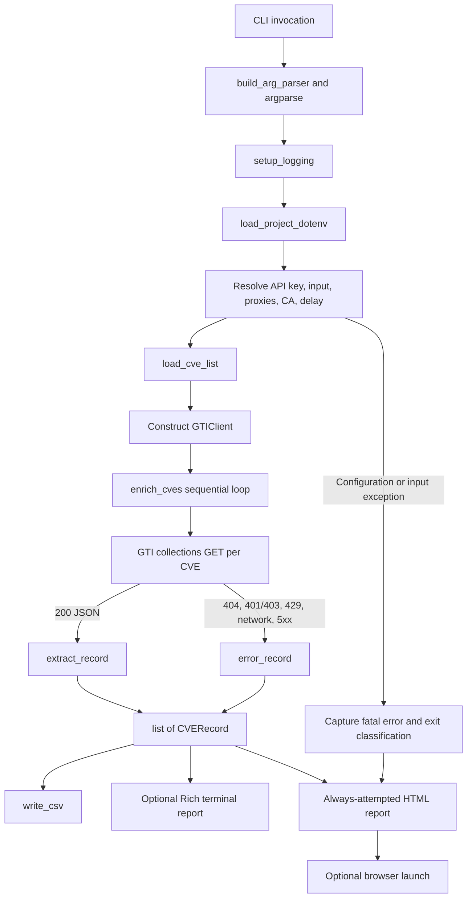
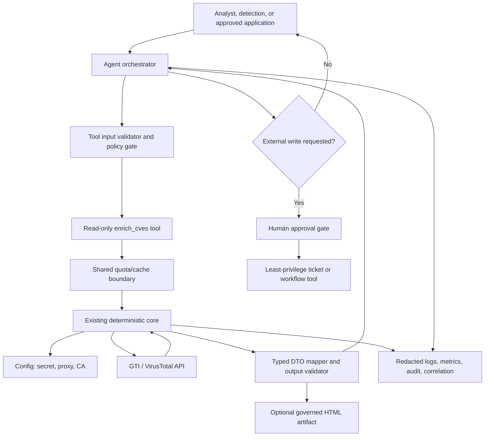

# Repository Technical Breakdown and Agentic Integration Analysis

## Scope and evidence

This document describes the repository as it exists at the time of analysis. It is based on the Python source, configuration templates, sample data, dependency manifest, setup guidance, certificate guidance, and `AGENTIC_INTEGRATION_IDEAS.md`. It does not treat proposals in `AGENTIC_INTEGRATION_IDEAS.md` as implemented behavior.

Terminology used throughout:

- **Existing** means directly implemented or documented in the current repository.
- **Inferred** means a reasonable conclusion from repository evidence, explicitly labeled as such.
- **Proposed** means described in `AGENTIC_INTEGRATION_IDEAS.md` or recommended by this analysis, but not present in the application.

No live VirusTotal request was needed to establish the architecture. API schema and license statements are therefore repository claims rather than independently verified service behavior.

## 1. Project Overview

### What the project does

This is a Python command-line application for enriching lists of Common Vulnerabilities and Exposures (CVE) identifiers with Google Threat Intelligence (GTI) Vulnerability Intelligence data delivered through the VirusTotal v3 collections API. The application accepts a CSV, normalizes and de-duplicates its CVE identifiers, fetches one vulnerability collection per identifier, flattens the nested response into a stable record, derives a GTI-style P0–P4 priority, and produces three analyst-facing forms of output:

1. A flat CSV intended for spreadsheets, SIEM ingestion, or ticket data.
2. Rich terminal cards for interactive review.
3. A self-contained HTML report with summary chips, per-CVE cards, and failure details.

The code intentionally creates the HTML report after the main enrichment block so configuration and runtime failures can still be presented visually. This guarantee begins after command-line parsing and imports have succeeded; an `argparse` usage error, missing Python dependency, interpreter failure, or inability to write the HTML file can still prevent a report.

### Primary purpose and intended users

Confirmed from `README.md`, `SETUP.md`, and source comments, the primary purpose is vulnerability triage and prioritization in a corporate environment. The intended users are security engineers and analysts who need decision-ready CVE context rather than raw GTI collection JSON. Downstream CSV consumers may include ticketing, SIEM, and spreadsheet workflows, but the repository contains no direct connector for any of those systems.

The project is specifically designed for enterprise Windows environments with an outbound web proxy and TLS inspection. Much of the Python remains portable, but setup instructions, browser fallbacks, virtual-environment commands, and certificate-export guidance emphasize Windows and PowerShell.

### Major existing workflows

- Load an API key, proxy URLs, CA-bundle path, and request delay from command-line overrides, process environment, or a project `.env` file.
- Parse flexible analyst-supplied CSV files, accepting common header names, several delimiters, a UTF-8 BOM, and both canonical and selected noncanonical CVE forms.
- Query `GET https://www.virustotal.com/api/v3/collections/vulnerability--{cve-lowercase}` sequentially with a shared `requests.Session`, inter-request throttling, bounded retry, exponential backoff, jitter, and selected status-specific handling.
- Transform GTI data into a `CVERecord`, including risk, exploitation, CISA KEV, EPSS, CVSS v2/v3/v4, CPE-derived products, mitigations, workarounds, narrative, dates, counters, and a GUI deep link.
- Derive a P0–P4 priority from risk rating, exploitation state, and exploit availability while retaining the API's raw `priority` value.
- Preserve one result row per accepted CVE even when a lookup fails or the client stops a batch after a privilege error.
- Write CSV and HTML artifacts, optionally display Rich terminal cards, optionally dump successful raw JSON, and normally open the HTML report in the default browser.

### Principal technologies

- Python 3, with repository documentation specifying Python 3.10 or newer.
- `requests` for HTTPS calls and session configuration.
- `python-dotenv` for local `.env` loading.
- `rich` for logging, progress display, tables, badges, and terminal panels.
- Standard-library modules for CLI parsing, CSV/JSON/HTML handling, path and environment management, logging, time/backoff, dataclasses, traceback capture, and browser launch.
- The filesystem for input and all persistence; there is no database, server, message broker, cache, or remote artifact store.

### How the components fit together

`cve_enricher.py` is both the entry point and the complete application. Configuration resolvers prepare a `GTIClient`; `load_cve_list()` prepares identifiers; `enrich_cves()` coordinates the API calls and uses `extract_record()` to normalize responses; a shared `CVERecord` then feeds CSV, terminal, and HTML renderers. This design is cohesive for a local tool, but it tightly couples configuration, networking, transformation, business rules, presentation, artifact management, and process exit behavior in one large module.

## 2. Repository Structure

Generated bytecode and the local `vtenv/` dependency environment are intentionally omitted from the main tree.

```text
virustotal/
├── cve_enricher.py                 # Existing application and CLI entry point
├── cve_list.csv                    # Existing sample CVE input
├── requirements.txt                # Existing direct Python dependencies
├── .env.example                    # Existing safe configuration template
├── .env                            # Existing ignored local configuration; may contain secrets
├── .gitignore                      # Existing secret/artifact/dependency exclusions
├── README.md                       # Existing overview, usage, flags, outputs, troubleshooting
├── SETUP.md                        # Existing extended enterprise setup guide
├── AGENTIC_INTEGRATION_IDEAS.md    # Existing primary agentic design/options document
├── BREAKDOWN.md                    # This analysis
└── certs/
    ├── .gitkeep                    # Keeps the certificate directory in Git
    └── README.md                   # Existing corporate-root-CA export guidance
```

Other repository state relevant to maintenance:

- `__pycache__/cve_enricher.cpython-313.pyc` is a generated artifact and is present in the Git tree even though `.gitignore` now excludes `__pycache__/` and `*.py[cod]`. It is not part of application design and should not be treated as source.
- `vtenv/` is a local virtual environment with its own ignore rule. It is dependency-heavy and not application source. Its `pyvenv.cfg` records Python 3.13.2 for this local environment, while the project documentation declares Python 3.10+ as the supported baseline.
- No test directory, test configuration, `pyproject.toml`, package setup metadata, lock file, Dockerfile, CI workflow, web-service definition, or deployment manifest was found.

### Important file and directory roles

| Path | Role and contents | Dependencies and consumers |
|---|---|---|
| `cve_enricher.py` | Entry point, configuration layer, data model, priority rules, input parser, GTI client, transformation logic, renderers, artifact writers, and orchestration. | Imports all declared packages. Reads `.env` and the input CSV. Calls VirusTotal. Writes CSV/HTML/raw JSON. Invoked directly by users. |
| `cve_list.csv` | Small example input with a `CVE` header and five CVE identifiers. It is also the default input path. | Read by `load_cve_list()` when no `--input` override is supplied. |
| `requirements.txt` | Four lower-bounded direct dependencies: `requests`, `rich`, `python-dotenv`, and `urllib3`. | Used during environment setup. There is no lock file for reproducible transitive versions. |
| `.env.example` | Placeholder-only template for the GTI key, HTTP/HTTPS proxy, optional CA bundle, and optional request delay. | Copied to `.env` by operators; names correspond to source resolvers. |
| `.env` | Ignored, local runtime configuration. The analyzed file declares the expected API-key and proxy variable names. Values are intentionally not reproduced here. | Loaded by `load_project_dotenv()` unless higher-precedence process values already exist. |
| `.gitignore` | Excludes local secrets, certificate files, Python environments/bytecode, generated reports, logs, and IDE/OS metadata. | Protects common sensitive and generated paths, but cannot retroactively remove already tracked bytecode. |
| `README.md` | Primary user guide: purpose, prerequisites, installation, configuration, CLI reference, output, troubleshooting, security, and quick start. | Refers to `SETUP.md`, `.env.example`, `certs/README.md`, and the CLI. Its file tree predates or omits `AGENTIC_INTEGRATION_IDEAS.md`. |
| `SETUP.md` | Detailed first-run instructions for API licensing, proxy routing, CA export, configuration precedence, connectivity checks, and failure diagnosis. | Supports operators configuring `.env` and `certs/`. |
| `AGENTIC_INTEGRATION_IDEAS.md` | Options and design document for converting the local CLI into a typed agent capability while preserving network/security properties. | Primary source for Sections 10–13 of this document. It does not change runtime behavior. |
| `certs/README.md` | Guidance for exporting a corporate SSL-inspection root certificate and placing it at `certs/corporate-ca.pem`; warns against disabling TLS verification. | Supports `resolve_ssl_verify()` and the documented default CA path. |
| `certs/.gitkeep` | Empty placeholder. | Keeps `certs/` available without committing certificate material. |

## 3. Application Architecture

### Architectural layers in the current single module

| Layer | Existing implementation | Notes |
|---|---|---|
| Entry point and process control | `main()` and the `if __name__ == "__main__"` block | Parses CLI arguments, owns exit codes, and ensures post-run HTML handling. |
| Presentation | Rich helpers, `render_rich_card()`, `print_rich_report()`, `render_html_report()`, `open_report_in_browser()` | Human-first. HTML is inline-CSS and offline-capable. |
| Business and decision logic | `derive_priority_rating()` | Deterministic GTI-style P0–P4 mapping plus fallback heuristics. |
| Input and transformation | `load_cve_list()`, normalization helpers, `extract_record()`, CPE and value helpers | Converts flexible CSV and variable GTI response shapes to a stable flat model. |
| Data model | `CVERecord` and `CSV_COLUMNS` | Display-oriented strings use `"N/A"`, `"True"`, and `"False"`; convenient for CSV/HTML, less suitable for typed agent JSON. |
| External API client | `GTIClient` and `_safe_error_body()` | Encapsulates session headers, proxy/TLS state, throttling, retry, and coarse error kinds. |
| Configuration | `.env`, CLI flags, environment-variable resolvers, `build_proxies()`, `resolve_ssl_verify()` | CLI usually wins, while a pre-set process environment wins over values in `.env` because dotenv loads with `override=False`. |
| Persistence | `write_csv()`, `render_html_report()`, optional `--dump-raw` wrapper | Filesystem only. No database, cache, transaction, retention, or concurrency control. |
| Logging and diagnostics | `setup_logging()`, standard `logging`, Rich progress, `_format_fatal_error()` | Logs/progress go to stderr; human cards go to stdout. Proxy credentials are redacted in startup logging. |

### Startup and execution flow



### Configuration and secrets handling

The default project directory is anchored to `Path(__file__).resolve().parent`, so the default `.env` and certificate paths do not depend on the caller's working directory. The dotenv search is: an explicitly named file if it exists, the script-adjacent `.env`, a distinct current-working-directory `.env`, then python-dotenv's parent-search fallback. A missing explicit `--env-file` does not itself stop fallback to another `.env`, which may be surprising to callers expecting the explicit path to be mandatory.

Existing precedence varies by setting:

- API key: CLI `--api-key`, then `VIRUSTOTAL_API_KEY`, then `VT_API_KEY`. Process values can have originated outside `.env`; documented placeholder values are rejected.
- Delay: CLI `--delay`, then `VT_REQUEST_DELAY`, then `1.0` second.
- Proxies: per scheme, CLI, `VT_*` alias, uppercase standard environment variable, then lowercase standard variable. One configured scheme is mirrored to the other.
- CA bundle: CLI argument, `CORPORATE_CA_BUNDLE`, `REQUESTS_CA_BUNDLE`, `SSL_CERT_FILE`, conventional project file if present, otherwise secure default trust (`True`). Explicit missing paths are fatal.

The API key is placed only in the `x-apikey` request header. The source contains no hard-coded API key. A real local `.env` exists and may hold sensitive values; it is correctly ignored. Proxy URLs may contain credentials, and startup logs redact the user/password portion. CLI `--api-key` remains available but the docs warn that command histories can expose it.

TLS verification is a deliberate invariant: `resolve_ssl_verify()` never returns `False`, and `GTIClient.__init__()` rejects `verify=False` as defense in depth. A public corporate root certificate may be supplied as a path; no private-key requirement exists.

### State, persistence, authentication, and trust boundaries

- Runtime state is in memory: a CVE list, a list of `CVERecord` values, a `requests.Session`, the timestamp of the last request, logging/progress state, and run-level error/exit state.
- Persistent state consists only of generated files. Existing output methods create parent directories and overwrite the selected output paths.
- Authentication is outbound API-key authentication to VirusTotal. There is no inbound API, user identity, role model, or multi-user authorization because the application is a local CLI.
- The GTI response is untrusted external data. Text is escaped before HTML insertion, which reduces HTML/script-injection risk in the report. Terminal and CSV representations are not executable by this program, although downstream spreadsheet formula handling is not explicitly addressed.
- No cache exists. Repeating a run repeats GTI requests.

### Error handling and logging

The client handles 200, 404, 401/403, 429, 5xx, other HTTP failures, invalid JSON, and `requests.RequestException`. Network errors, 429, and eligible 5xx responses receive bounded backoff; 401/403 and 404 return immediately. After retry exhaustion, error detail is reduced to an error kind and status, so the orchestration layer often records only `Request failed (HTTP ...)` rather than the original proxy, TLS, exception, error body, or retry delay.

At orchestration level, configuration/input/client-construction exceptions become an HTML-safe formatted fatal error and exit code 1 or 2. Per-CVE failures become records rather than exceptions. If the first privilege failure is encountered and `--continue-on-forbidden` is absent, remaining CVEs are marked `forbidden`/skipped without more requests. Browser-launch failures are best-effort and do not replace enrichment results. HTML-write failure can change a successful exit to 1 but preserves an already nonzero exit.

Logs and Rich progress use stderr, leaving stdout for terminal cards or future structured output. There is no log-file configuration, structured JSON logging, correlation ID, metrics, audit sink, health probe, or distributed tracing.

## 4. Python Script Breakdown

### `cve_enricher.py`

#### Purpose

This is the repository's only Python source module and its executable entry point. It implements the entire local CVE-enrichment lifecycle: configuration, input validation, API access, data flattening, priority derivation, error records, CSV export, Rich output, HTML generation, browser launch, and process exit semantics.

#### Important imports

| Import group | Why it matters |
|---|---|
| `requests` | Creates the persistent GTI HTTP session, sends authenticated requests, applies proxy and CA verification, and defines network exceptions. |
| `dotenv.load_dotenv` | Loads project-local configuration into `os.environ` without replacing values already set by the process. |
| `rich` modules | Provide stderr logging/progress and stdout panels, tables, badges, and summaries. |
| `argparse`, `csv`, `json`, `html` | Define the CLI, parse and write CSV, decode/dump JSON, and escape untrusted text for HTML. |
| `dataclasses` and typing | Define the flat `CVERecord` and annotate the large transformation surface. |
| `pathlib`, `os`, `subprocess`, `webbrowser`, `sys` | Resolve paths/configuration, create output directories, and open reports, including Windows fallbacks. |
| `time`, `random` | Implement inter-request throttling and jittered exponential backoff. |
| `logging`, `traceback` | Produce operational messages and embed bounded failure details in HTML. |

#### Configuration functions and constants

| Name | Inputs and outputs | Behavior, side effects, dependencies, and workflow role |
|---|---|---|
| `PROJECT_ROOT`, `DEFAULT_*`, `CVE_PATTERN`, `NO_KNOWN_ALIASES` | Module constants. | Define safe defaults, object-ID validation, output names, retry policy, endpoint, and priority-label normalization. The API base is fixed in source except when constructing `GTIClient` directly. |
| `load_project_dotenv(env_file=None)` | Optional `Path`; returns loaded resolved `Path` or `None`. | Searches candidate `.env` files and calls `load_dotenv(override=False)`, mutating process environment. It is called early by `main()`. |
| `resolve_request_delay(cli_value=None)` | Optional number; returns `float`. | Enforces CLI-over-environment precedence. Invalid environment text logs a warning and falls back; a nonpositive value disables throttling later. |
| `resolve_api_key(cli_value=None)` | Optional string; returns a nonplaceholder string or `None`. | Resolves the key without logging it. `main()` treats `None` as a configuration error. |
| `resolve_ssl_verify(ca_bundle=None)` | Optional path string; returns absolute path string or `True`. | Resolves a custom trust bundle, expands `~`, accepts project- or working-directory-relative paths, raises for explicit missing files, and never permits disabled verification. It reads environment variables and filesystem state. |
| `describe_ssl_verify(verify)` | Boolean/path; returns a display string. | Produces startup diagnostics. When a path is used, the absolute path is logged; that is useful locally but may expose usernames/directory layout in shared logs. |
| `build_proxies(http_proxy, https_proxy)` | Optional CLI strings; returns a `requests` proxy dict or `None`. | Resolves proxy variables and mirrors a single URL across HTTP/HTTPS. It does not validate URL syntax. |

#### Data model and normalization helpers

| Name | Inputs and outputs | Behavior, side effects, dependencies, and workflow role |
|---|---|---|
| `CVERecord` | Dataclass constructed with a CVE and optional fields; produces an in-memory flat record. | Central contract shared by all renderers. Contains status/error, P0–P4 and risk, exploitation, KEV, EPSS/CVSS, products, narrative, dates, identifiers, counts, GUI URL, and a truncated debug JSON bag. Most missing/native values are converted to display strings. |
| `CSV_COLUMNS` | Ordered field-name list. | Fixes CSV schema/order and intentionally omits `extra_json`. Must be manually kept in sync with the dataclass. |
| `na(value, default="N/A")` | Any value; returns a string. | Converts `None`, booleans, lists/tuples, floats, and text to common display forms. This creates consistent outputs but erases native types. |
| `fmt_ts(value)` | Timestamp/date-like value; returns a date/display string. | Preserves nonempty strings, interprets large integers as milliseconds, formats numeric UTC timestamps, and tolerantly falls back on malformed values. |
| `normalize_cve(raw)` | Raw string; returns canonical CVE string or `None`. | Removes spaces, converts underscores, uppercases, accepts bare `YYYY-NNNN`, and enforces at least four digits after the second hyphen. It does not extract CVEs from arbitrary natural-language sentences. |
| `cve_api_id(cve)` | Canonical CVE; returns `vulnerability--cve-...`. | Creates the object identifier shared by API and GUI URLs. |
| `_accept_cve(raw, cves, seen)` | Raw string and mutable accumulation containers; returns `None`. | Normalizes, de-duplicates in first-seen order, appends accepted IDs, and logs invalid values. |
| `_norm_label(value)` / `_is_no_known(value)` | Strings; return normalized string/boolean. | Collapse whitespace/case and recognize absence/unknown exploit labels for the priority decision table. |

#### Priority and input logic

| Name | Inputs and outputs | Behavior, side effects, dependencies, and workflow role |
|---|---|---|
| `derive_priority_rating(risk_rating, exploitation_state, exploit_availability)` | Three labels; returns `P0`–`P4` or `N/A`. | Encodes the documented GTI decision table, normalizes aliases, and applies best-effort fallbacks for combinations outside the exact table. It is deterministic and has no side effects. The output is a repository-derived rating, not necessarily an API-supplied P value. |
| `load_cve_list(path)` | Input path; returns ordered unique `list[str]`. | Reads UTF-8 with BOM support, sniffs comma/semicolon/tab/pipe delimiters, detects headered vs headerless input, recognizes common CVE column names, falls back to the leftmost column, logs invalid cells, and raises for missing/empty schema conditions. It reads at most 4096 bytes for dialect detection, then parses the full file. |

#### GTI client

| Name | Inputs and outputs | Behavior, side effects, dependencies, and workflow role |
|---|---|---|
| `GTIClient.__init__(...)` | API key plus base URL, proxy, verification, timeout, retry, backoff, delay; initializes a client. | Validates key/TLS, creates one `requests.Session`, sets `x-apikey`, `accept`, and `User-Agent`, applies proxies and CA verification, and logs TLS mode. The key is held in session headers. |
| `GTIClient._throttle()` | No external input; returns `None`. | Uses monotonic time and sleeps to maintain the per-client delay. State is process-local, so independent CLI processes do not share a throttle. |
| `GTIClient.get_vulnerability(cve)` | CVE string; returns `(JSON-or-None, error-kind-or-None, HTTP-status)`. | Sends the collections GET with a 60-second timeout. Retries request exceptions, 429, and eligible 5xx responses with backoff/jitter; honors integer `Retry-After`; classifies 404 and 401/403; returns coarse error details. Network and sleep are important side effects. |
| `_safe_error_body(response, limit=300)` | Response; returns short string. | Extracts and truncates JSON or text error content for logs, avoiding unbounded proxy/captive-portal pages. It assumes the API key cannot occur in the response body; future upstream echo behavior would require additional redaction. |

#### Response extraction

| Name | Inputs and outputs | Behavior, side effects, dependencies, and workflow role |
|---|---|---|
| `_first(*values, default=None)` | Candidate values; first nonempty value. | Implements tolerant alias lookup across GTI schema variations. |
| `_format_cpes(cpes)` | Expected list of CPE-range objects; returns flattened string and count. | Extracts vendor/product/version ranges, falls back to CPE URI, de-duplicates in first-seen order, and joins entries with ` | `. Structured CPE components are lost after flattening. |
| `extract_record(cve, payload)` | Canonical CVE and response dict; returns `CVERecord`. | Validates `data`, tolerantly reads CVSS/EPSS/exploitation/KEV/risk/CPE/CWE/counters/narrative fields and aliases, formats values, derives priority, constructs the GUI URL, and stores a capped `extra_json` fragment. It deliberately does not infer in-the-wild exploitation from an exploitation-state label. Malformed top-level data becomes an error record. |
| `error_record(cve, status, message)` | CVE/error data; returns `CVERecord`. | Creates a non-success row with a GUI link so failed and skipped CVEs remain visible in output. |

#### Output and presentation

| Name | Inputs and outputs | Behavior, side effects, dependencies, and workflow role |
|---|---|---|
| `write_csv(records, path)` | Record iterable and destination; returns `None`. | Creates parent directories, overwrites the CSV, writes stable columns, and collapses newlines in selected narrative/product fields. Logs the path. |
| `_risk_style()`, `_priority_color()`, `_bool_badge()` | Display strings; return Rich styles/text. | Centralize terminal presentation mappings; do not affect scoring. |
| `render_rich_card(rec)` | One record; returns a Rich `Panel`. | Produces an error panel or a detailed success card with scores, exploitation, KEV, context, summary, and a capped product preview. |
| `print_rich_report(records)` | Record list; returns `None`. | Prints an aggregate summary and all cards to stdout. This is incompatible with a JSON-only agent stdout unless disabled. |
| `_html_risk_class()`, `_html_escape()`, `_html_bool()` | Display values; return CSS class or HTML fragment. | Centralize HTML presentation and escaping. `_html_escape()` is important because GTI narrative and product data are external content. |
| `render_html_report(records, path, title, fatal_error=None)` | Records, output path, title, optional fatal detail; returns `None`. | Builds a complete inline-CSS HTML document, caps long summaries/products, includes per-CVE error cards and run-level failure banners, creates parent directories, and overwrites the path. No CDN or remote stylesheet is used. |
| `open_report_in_browser(path)` | Report path; returns `None`. | Resolves the file and tries `webbrowser.open`; on Windows, falls back to `os.startfile` and `cmd /c start`. Failures are logged rather than raised. It launches an external application unless `--no-open` prevents the call. |

#### Orchestration

| Name | Inputs and outputs | Behavior, side effects, dependencies, and workflow role |
|---|---|---|
| `setup_logging(verbose=False)` | Verbosity flag; returns `None`. | Configures root logging with a Rich handler on stderr. Existing host applications importing this module may not want global `logging.basicConfig()` side effects. |
| `_format_fatal_error(exc)` | Exception; returns type/message plus bounded traceback. | Preserves diagnostic detail for HTML. The traceback can expose local paths or selected input values, so it is not yet an agent-safe error contract. |
| `enrich_cves(client, cves, stop_on_forbidden=True)` | Client, identifiers, policy flag; returns record list. | Sequentially queries and transforms every CVE, displays progress, logs results, creates error records, and optionally stops network activity on privilege failure while marking the remaining identifiers. This is the closest existing function to a reusable application service API. |
| `build_arg_parser()` | No input; returns `ArgumentParser`. | Defines input/output/report, display, API/network, retry, raw-dump, environment-file, and verbosity flags. Defaults preserve the local human workflow. |
| `main(argv=None)` | Optional argument list; returns exit code. | Owns the end-to-end lifecycle, optional monkey-patching of the client for raw dumps, output generation, exception classification, and always-attempted HTML/browser block. |
| `if __name__ == "__main__"` | Process entry. | Calls `sys.exit(main())`, propagating codes 0–3 to the shell. |

## 5. Python Comments and Docstrings

The Python source is heavily documented. Comments are not merely restating syntax: they capture corporate-network constraints, data-contract decisions, GTI schema assumptions, scoring rules, failure behavior, and presentation intent. No `TODO`, `FIXME`, `XXX`, or `HACK` marker was found. Future work is concentrated in `AGENTIC_INTEGRATION_IDEAS.md`, not source TODOs.

### Meaningful comment and docstring groups

| File/section | What the comments communicate | Why it matters | Assessment |
|---|---|---|---|
| `cve_enricher.py` module docstring | Purpose, endpoint, required license, variables, usage, corporate CA rule, HTML behavior, and a historical cleanup log. | Gives maintainers an unusually complete operational overview before code begins. | **Important**, but the cleanup log is historical maintenance metadata and will become stale more quickly than user-facing design documentation. |
| Import comments | Explain why each standard/third-party library exists, including separation of stdout/stderr and avoidance of secret logging. | Clarifies that browser opening, traceback capture, jitter, and Rich are deliberate product behavior. | Useful educational documentation; somewhat verbose for stable imports. |
| Configuration defaults | Explain script-directory anchoring, safe defaults, CA convention, and the prohibition on hard-coded secrets. | Prevents a future refactor from accidentally making behavior depend on the caller's working directory or weakening TLS. | **Especially important security/design guidance.** |
| Dotenv section and `load_project_dotenv()` | Explain why `.env` is preferred on locked-down Windows desktops and why `override=False` lets CI/session configuration win. | Captures configuration precedence and an enterprise usability decision. | Important. The parent-directory fallback and nonfatal missing explicit file deserve equally prominent documentation because they can load a different file than a caller expects. |
| API-key placeholder comments | Explain rejection of documented dummy values before network use. | Converts confusing 401s into actionable configuration failures and avoids sending junk credentials. | Important and current. |
| TLS comments and `resolve_ssl_verify()` docstring | Explain SSL inspection, root-CA use, `expanduser`, explicit missing-file failure, resolution order, and why `verify=False` is never acceptable. | This is the core security invariant and a prerequisite for any wrapper/service. | **Most important comment group in the module.** Preserve its substance in any architectural split. |
| `CVERecord`/`CSV_COLUMNS` comments | Explain one flat shared model, sentinel strings, status values, field groups, and omission of `extra_json` from CSV. | Shows why presentation is consistent and why typed agent output now requires a boundary mapper. | Important. The claim that `extra_json` is for advanced/SIEM consumers is **ambiguous** because it is neither in CSV nor current HTML; only in-memory callers see it, while `--dump-raw` is a separate mechanism. |
| Helper comments/docstrings | Explain float formatting, timestamp heuristics, input normalization, and first-seen de-duplication. | Prevents subtle display and input behavior from diverging across output formats. | Useful. The year-2286/millisecond heuristic is a pragmatic workaround and should be tested. |
| Priority derivation block | Records the external GTI guidance URL and the complete P0–P4 decision table, aliases, and fallbacks. | This is decision logic that can affect operational urgency; the comments are effectively its specification. | **Critical and audit-sensitive.** The fallback rules are repository policy, not the exact table, and must be distinguished in tests and agent responses. |
| CSV input block | Explains BOM/delimiter/header tolerance and the choice to skip one bad cell rather than fail a batch. | Documents a resilience/usability decision for analyst exports. | Important. Invalid IDs are logged but absent from result records, which conflicts with the future agent goal of accounting for every requested input unless the tool boundary reports validation rejections separately. |
| `GTIClient` construction contract | States that verification cannot be false, proxies belong on the session, the key uses `x-apikey`, and the constructor rechecks invariants. | Protects outbound authentication and TLS when the client is reused outside `main()`. | **Especially important.** |
| Retry/status comments | Explain which conditions retry, why 401/403 and 404 do not, how 429 honors `Retry-After`, and why jitter is used. | Makes quota and failure policy auditable. | Important. After retries, the returned tuple loses much of this detail, which is technical debt for agent-safe errors. |
| Extraction comments | Explain schema alias tolerance, CPE fallback/de-duplication, KEV presence semantics, raw-vs-derived priority, and capped raw fragments. | These are data-mapping assumptions that must stay stable across GTI schema changes. | **Important and schema-sensitive.** They indicate a need for fixture tests. |
| In-the-wild non-inference comment | Explicitly refuses to infer `exploited_in_the_wild` from `Wide`/`Confirmed` exploitation state. | Prevents the report from overstating evidence or contradicting an explicit/absent API boolean. | **Especially important correctness constraint** and a good example of deterministic behavior an agent must not override. |
| CSV/Rich/HTML blocks | Explain flat export, newline collapsing, consistent color vocabulary, offline inline CSS, truncation, and the human need for an always-attempted failure report. | Documents presentation decisions and corporate-network usability. | Current. The README phrase “after every run” is broader than the implementation because parse/import/write failures can preempt it. |
| Browser helper docstring/comments | Explain why failure reports open, Windows fallbacks, empty `start` title, and best-effort error policy. | Preserves a deliberate human workflow and prevents browser problems from masking enrichment. | Important for local use; intentionally unsuitable as the default in agent/service mode. |
| Orchestration order comments | Call the sequence “load-bearing” and explain why the HTML block sits outside the primary try. | Makes a nonobvious error-report guarantee visible to maintainers. | **Especially important.** A future split should preserve behavior with clearer service-level control rather than relying on block placement. |
| Raw-dump comments | Explain runtime wrapping of successful GETs for offline schema debugging without changing enrichment. | Shows raw responses are a diagnostic feature, not an agent/default data source. | Useful but indicates technical debt: monkey-patching a bound method is harder to test and govern than an explicit observer/artifact interface. |
| Broad `except` annotations | State that broad catches are deliberate for best-effort UI and guaranteed failure-report generation. | Explains otherwise suspicious exception handling. | Justified at process boundaries, but internal errors need stable typed mapping before agent exposure. |

### Comments that appear ambiguous, dated, or debt-indicating

- The module-level “Cleanup log” documents previously removed code. It is accurate historical context but belongs more naturally in version history; future edits may leave it stale.
- The source and user docs repeatedly describe HTML as generated after “every run.” The implementation can only guarantee an attempt after successful imports, argument parsing, and logging setup, and the HTML write itself may fail.
- The priority comments accurately separate the API's raw boolean-like value from the UI-style P0–P4 derivation. Any output that simply labels P0–P4 as “GTI priority” without “derived” would be ambiguous.
- The `extra_json` description suggests advanced consumption, but no current output exports it except via in-memory use; `--dump-raw` writes a different, full payload.
- Comments recognize GTI field-name drift and use aliases, which is healthy defensive coding but also a clear signal that automated fixture/contract tests are needed.
- No inline future-agent TODO exists. This avoids unfinished-code markers, but it means the agentic design document must remain the explicit source of planned behavior.

## 6. Key Workflows

### Workflow A: Configuration and startup

```text
User invokes CLI
  ↓
argparse validates flags and types
  ↓
Rich-backed stderr logging is configured
  ↓
.env is loaded without overriding existing process values
  ↓
API key, CSV path, proxies, CA path, delay, retry policy are resolved
  ↓
GTIClient validates the key/TLS invariant and binds a requests.Session
```

Files/functions involved: `.env`, `.env.example`, `build_arg_parser()`, `load_project_dotenv()`, `resolve_api_key()`, `build_proxies()`, `resolve_ssl_verify()`, `resolve_request_delay()`, and `GTIClient.__init__()`.

Failure behavior: a missing/placeholder key, unreadable input, empty valid-CVE set, explicit missing CA, or client validation error becomes a run-level fatal message and exit 2. Other unexpected exceptions normally become exit 1. After parsing, HTML generation is still attempted.

### Workflow B: CSV ingestion and CVE normalization

```text
Input CSV path
  ↓
Read UTF-8 with BOM stripping and sniff delimiter
  ↓
Detect headered or headerless layout
  ↓
Select known CVE column or leftmost fallback
  ↓
Normalize case/separators/prefix and validate regex
  ↓
Skip invalid cells, de-duplicate, preserve first-seen order
```

Files/functions involved: input such as `cve_list.csv`, `load_cve_list()`, `_accept_cve()`, and `normalize_cve()`.

Human role: users create or select the CSV and correct skipped invalid values. Existing code does not return structured rejected-input objects.

### Workflow C: GTI lookup with quota and network handling

```text
Canonical CVE
  ↓
Build vulnerability--cve-yyyy-nnnn object ID
  ↓
Throttle using per-client monotonic timestamp
  ↓
Session GET through configured proxy with TLS verification and x-apikey
  ↓
200 → decode JSON
404 → not_found
401/403 → forbidden; optionally stop remaining calls
429/network/eligible 5xx → bounded backoff and retry
other/final failure → error or rate_limited
```

Files/functions/external systems: `cve_api_id()`, `GTIClient._throttle()`, `GTIClient.get_vulnerability()`, `_safe_error_body()`, corporate proxy/TLS inspection infrastructure, and VirusTotal/GTI.

### Workflow D: Response transformation and prioritization

```text
GTI JSON data.attributes
  ↓
Tolerant key/alias lookup
  ↓
Normalize CVSS, EPSS, exploitation, KEV, risk, products, narrative, dates
  ↓
Derive P0–P4 from risk + state + availability
  ↓
Prefer an explicit API P0–P4 string if one is supplied
  ↓
Create flat CVERecord and capped debug fragment
```

Files/functions involved: `_first()`, `fmt_ts()`, `na()`, `_format_cpes()`, `derive_priority_rating()`, and `extract_record()`.

Important correctness boundary: the code preserves an explicit/absent `exploited_in_the_wild` signal and does not infer it from exploitation state. Priority fallback heuristics are deterministic repository logic.

### Workflow E: Batch orchestration and complete accounting

`enrich_cves()` iterates sequentially with Rich progress on stderr. Each accepted CVE becomes either a transformed success record or `error_record()`. A privilege error can stop later network calls, but later CVEs still receive skipped/forbidden records. This makes the CSV and HTML account for all accepted CVEs, although invalid raw input cells were removed earlier.

### Workflow F: Outputs and failure report

```text
list[CVERecord]
  ├─→ write_csv → flat artifact
  ├─→ print_rich_report → interactive stdout cards
  └─→ render_html_report → self-contained HTML
                                  ↓
                         open_report_in_browser unless --no-open
```

CSV is written after the enrichment loop even if all per-CVE records are errors; configuration failures before the loop skip CSV. HTML is attempted for successful, partially successful, all-failed, and caught fatal runs. Optional `--dump-raw` writes one JSON file for each successful response before transformation returns to the loop.

## 7. External Integrations and Dependencies

### VirusTotal / Google Threat Intelligence

- **Where used:** `GTIClient.get_vulnerability()`.
- **Purpose:** retrieve Vulnerability Intelligence collection data for each CVE.
- **Data sent:** the normalized CVE is embedded in the URL path; the enterprise API key is sent in `x-apikey`; standard accept and user-agent headers are also sent. The application does not send asset inventories or user prompts.
- **Data retrieved:** collection JSON containing risk, priority, exploitation, KEV, EPSS, CVSS, affected products/CPEs, CWE, narrative, mitigations, workarounds, dates, and counters where available.
- **Configuration:** GTI Enterprise or Enterprise Plus with Vulnerability Intelligence is stated as required. `VIRUSTOTAL_API_KEY` or `VT_API_KEY` supplies the credential.
- **Failure handling:** explicit handling for 404, 401/403, 429, malformed JSON, request exceptions, 5xx, and other errors. Error-body previews are capped. Retry is bounded.

### Corporate HTTP proxy

- **Where used:** `build_proxies()` and `GTIClient.__init__()`.
- **Purpose:** permit or enforce enterprise outbound routing.
- **Configuration:** `--http-proxy`, `--https-proxy`, `VT_HTTP_PROXY`, `VT_HTTPS_PROXY`, `HTTP_PROXY`, `HTTPS_PROXY`, and lowercase standard aliases.
- **Sensitive material:** a proxy URL can include credentials. Actual values are not reproduced. Startup logging redacts the `user:password@` segment.
- **Failure handling:** proxy connection failures surface through `requests.RequestException` and receive retries, but the eventual result does not preserve a distinct proxy error type. Proxy HTTP 407 is not specially classified by current code.

### Corporate TLS inspection / certificate trust

- **Where used:** `resolve_ssl_verify()` and `GTIClient` session verification.
- **Purpose:** trust the public root certificate used by an authorized enterprise inspection proxy without disabling HTTPS verification.
- **Configuration:** `--ca-bundle`, `CORPORATE_CA_BUNDLE`, `REQUESTS_CA_BUNDLE`, `SSL_CERT_FILE`, or `certs/corporate-ca.pem` if present.
- **Security:** only a public certificate should be stored; certificate/private-key material must not be committed. Explicit missing paths fail closed. `verify=False` is rejected.

### Python libraries

| Dependency | Existing use | Failure/operational considerations |
|---|---|---|
| `requests>=2.31.0` | HTTP session, proxies, TLS verification, response parsing, exceptions. | No exact pin; behavior can move with later releases. |
| `rich>=13.7.0` | Logging, progress, panels, tables, colors. | Required at import time even when `--no-rich` is used, so a headless agent cannot omit it without a code change. |
| `python-dotenv>=1.0.0` | `.env` loading. | Parent-search fallback and environment precedence are part of runtime behavior. |
| `urllib3>=2.0.0` | Declared explicitly although not imported directly; used under `requests`. | Direct lower-bound plus `requests` dependency can resolve to varying versions without a lock file. |

### Browser and local OS integration

`webbrowser`, `os.startfile`, and `cmd /c start` open the generated report. This is useful for the human CLI and inappropriate for services, CI, or agent tool calls. The `--no-open` switch already suppresses it.

### Integrations that do not currently exist

There is no implemented LLM/agent framework, MCP server, FastAPI/Flask endpoint, ticketing API, ServiceNow connector, SIEM client, database, cache, message queue, object storage, scheduler, identity provider, or secret-manager SDK. References to those capabilities in agentic planning are proposals or illustrative integration targets.

## 8. Configuration and Environment Requirements

### Run requirements confirmed by the repository

- Python 3.10+ according to `README.md` and `SETUP.md`. A local ignored virtual environment records Python 3.13.2, but that does not by itself prove all supported versions have been tested.
- Install dependencies with `pip install -r requirements.txt`.
- Network access to `https://www.virustotal.com`, commonly through a corporate HTTP proxy.
- A VirusTotal/GTI API key with the documented enterprise Vulnerability Intelligence entitlement.
- A trusted corporate inspection root CA file when enterprise TLS interception is present and Python's default trust does not already include it.
- A readable CSV containing at least one identifier accepted by `normalize_cve()`.
- Write access to the selected CSV/HTML/raw-dump destinations and, unless `--no-open` is used, a usable desktop/browser environment.

### Environment variables

| Variable | Required | Resolution/use |
|---|---|---|
| `VIRUSTOTAL_API_KEY` | Yes unless supplied by CLI/alias | Preferred GTI key. |
| `VT_API_KEY` | Alternative | API-key alias. |
| `HTTP_PROXY` / `HTTPS_PROXY` | Network-dependent | Standard proxy values. One side is mirrored if only one is configured. |
| `http_proxy` / `https_proxy` | Alternative | Lowercase proxy fallbacks. |
| `VT_HTTP_PROXY` / `VT_HTTPS_PROXY` | Alternative | Script-specific proxy aliases preferred over standard variables after CLI. |
| `CORPORATE_CA_BUNDLE` | Network-dependent | Preferred custom CA path. |
| `REQUESTS_CA_BUNDLE` / `SSL_CERT_FILE` | Alternative | Standard CA path variables. |
| `VT_REQUEST_DELAY` | Optional | Inter-request delay; invalid text falls back to 1.0 seconds. |

### Files and default locations

- Default environment file: `.env` next to `cve_enricher.py`.
- Default input: `cve_list.csv`, resolved relative to the current working directory because `Path(args.input)` is not anchored to `PROJECT_ROOT`.
- Default CSV output: `cve_enriched.csv`, relative to the current working directory.
- Default HTML output: `report.html`, relative to the current working directory.
- Conventional CA: `certs/corporate-ca.pem` anchored to the script directory.
- Raw JSON: only when `--dump-raw DIR` is supplied.

### Startup

Typical documented invocation:

```powershell
python cve_enricher.py -i cve_list.csv -o cve_enriched.csv --html report.html
```

Minimal invocation uses all path defaults:

```powershell
python cve_enricher.py
```

For noninteractive use, add `--no-open`; add `--no-rich` if stdout cards are unwanted. There is no current `--json` or direct `--cve` option.

### Items not determinable from the repository

- Exact tested Python/library versions and a reproducible dependency set.
- The organization's actual proxy hostname, authentication method, CA chain, GTI rate limit, key-rotation practice, or license terms.
- Whether the deployed Python build uses the Windows trust store or certifi.
- A supported operating-system matrix beyond the stated Windows focus.
- Deployment, scheduling, backup, artifact retention, log aggregation, and monitoring policy.

## 9. Current Automation Capabilities

### Fully automated once a user starts a valid run

- `.env` loading and configuration resolution.
- CSV dialect/header handling, CVE normalization, invalid-value skipping, de-duplication, and order preservation.
- Object-ID and GUI-link construction.
- Sequential API lookup, session reuse, throttling, retry/backoff/jitter, selected `Retry-After` handling, and early privilege-stop behavior.
- Tolerant extraction across known schema aliases.
- Deterministic P0–P4 derivation and display normalization.
- Creation of per-CVE failure/skipped records.
- CSV, terminal, and HTML rendering, including an attempted HTML failure report.
- Optional browser launch and optional successful-response raw JSON dump.
- Process exit classification.

### Partially automated

- Vulnerability prioritization: the code calculates P0–P4, but it does not combine the result with asset criticality, exposure, compensating controls, ownership, business impact, patch availability, or an organizational SLA.
- Error recovery: bounded network/429/5xx retry exists, but persistent failures need an operator and do not produce typed retry guidance for another system.
- Report generation: artifacts are created, but distribution, access control, attachment, cleanup, and retention are manual.
- Configuration validation: obvious missing keys/CA paths are caught, but there is no readiness check or proactive proxy/license test.

### Manual input and human review

- Obtain the correct GTI entitlement/key and configure `.env` securely.
- Obtain proxy details and export/place the correct corporate root CA.
- Create/select the CVE CSV and run the command.
- Review skipped invalid identifiers and distinguish GTI `not_found` from “not vulnerable.”
- Interpret risk in local asset/business context and decide remediation/escalation.
- Transfer CSV/HTML results into tickets, SIEM, or other systems.
- Diagnose durable configuration, proxy, CA, privilege, and upstream failures.

### Hard-coded mappings and decisions

- VirusTotal API base, collections resource form, GUI-link form, user agent, 60-second request timeout, retry/backoff defaults, placeholder keys, CVE regex, accepted CSV column names, output column order, display colors, HTML limits, error wording, P0–P4 table, and fallback priority heuristics.
- These are deterministic and often appropriate, but changes require editing the monolithic source and should be regression-tested.

### Human-review boundary

The tool returns threat-intelligence context, not an authoritative remediation decision. It does not prove whether a particular asset is vulnerable, exposed, exploitable in its deployed configuration, already mitigated, or owned by a particular team. A human or a separately governed deterministic policy must supply that context before paging, closing findings, changing assets, or committing to an SLA.

## 10. Analysis of `AGENTIC_INTEGRATION_IDEAS.md`

### Overall intent

The document proposes changing the operating model from a local, human-invoked CLI to a reusable agent capability without replacing the mature deterministic parts of the application. Its thesis is that the existing product core is `GTIClient`, normalization/extraction, priority logic, corporate proxy/CA handling, structured per-CVE statuses, and HTML rendering. Agentic work should add a stable typed boundary, honest errors, controlled transports, and governance rather than reimplementing the enricher.

### Proposed patterns and architectural implications

| Pattern | Problem it solves | Existing components affected | New capabilities/prerequisites | Complexity and principal limitations |
|---|---|---|---|---|
| A. Local subprocess/CLI tool | Lets one analyst's local agent call enrichment quickly without a new service. | `build_arg_parser()`, `main()`, `enrich_cves()`, stdout/Rich/browser behavior, `CVERecord` mapping. | Add `--json`, repeatable/direct `--cve`, a versioned response envelope, and agent mode that implies no Rich/browser. Tight executable allowlist and inherited local secrets/network config. | **Low**, estimated 1–3 days in the source document. Still process-per-call, workstation-secret, and per-process-throttle constrained; generic shell access is unsafe. |
| B. FastAPI/Flask service | Provides a shared key/session/throttle/cache and an internal endpoint for multiple agents/SOAR clients. | Requires separating the current module into reusable configuration, client, records, priority, and orchestration units while preserving behavior. | Internal deployment, inbound TLS/auth, workload identity, secret injection, readiness/liveness, caching, quota management, request limits, artifact storage, and operations. | **Medium to high operational complexity**, estimated 1–2 weeks for an internal MVP plus production hardening. Creates a second network hop and must distinguish its TLS/proxy rules from outbound GTI access. |
| C. Native typed tool/function/MCP | Gives the model a narrow schema it can select and call, rather than shell or HTML. | Uses Pattern A or B as transport; maps to `normalize_cve()` and `enrich_cves()`. | JSON Schema, compact result policy, max batch size, tool description, framework binding, and evals that prove the model does not invent missing scores. | **Medium**, another 2–5 days after a callable backend. Schema alone does not prevent fan-out, tool loops, or oversized results. |
| D. Queue/event worker | Absorbs scanner bursts, decouples detection/agent availability from GTI, and supports pipeline-first enrichment. | Reuses the future service library/client/contract and moves orchestration to a worker. | Existing internal broker, producer/consumer identity, back-pressure, idempotency keys, results store/cache, poison-message handling, correlation, and retention. | **High**, estimated 3–6 weeks after a service if a broker already exists. The document explicitly advises against introducing a queue solely for this tool. |
| E. Hybrid JSON plus optional HTML | Serves agent reasoning and human review without making the agent parse HTML. | `render_html_report()` remains; JSON becomes primary in agent mode; browser/Rich become opt-out defaults for agents. | Artifact path/URL policy, ACLs, retention, and `include_html` default false. | **Low incremental complexity** once JSON exists, but continuous report generation can expose data or fill storage without governance. |

### Recommended data contract

The document identifies the existing `CVERecord` as display-oriented and proposes a versioned `EnrichmentResponse` containing native JSON types, run counts, one typed record per CVE, optional artifacts, and a structured run-level error. It groups EPSS, CVSS versions, exploitation, KEV, and affected products rather than returning flat sentinel strings. Long narrative, full products, and raw fragments are opt-in; a compact “LLM view” is the default.

Concrete repository implications:

- Add a boundary mapper rather than changing current CSV/HTML semantics immediately.
- Convert `"N/A"` to `null`, boolean strings to booleans, score strings to numbers, and delimited strings to lists/objects.
- Preserve both derived `priority_rating` and raw API priority.
- Report rejected raw inputs separately so every tool request is accounted for.
- Version the schema and test it against current `CVERecord` fields and aliases.
- Do not expose `extra_json`/raw payload by default.

### Security and corporate-network implications

The document treats two network hops separately:

1. Agent to a future internal executor/service.
2. Executor to VirusTotal through the corporate proxy and inspection CA.

It requires preserving `build_proxies()`, `resolve_ssl_verify()`, and the `verify=False` guard for hop 2. A service introduces separate internal DNS, corporate-PKI TLS, workload authentication, `NO_PROXY`, and timeouts for hop 1. GTI keys, proxy credentials, CA paths, delay/retry values, and arbitrary VirusTotal URLs must not be LLM tool parameters. A service/container should inject secrets and mount the public CA bundle rather than copy `.env` into an image.

### Reliability, observability, and failure implications

The proposed agent must receive one stable response shape even on failure. Run-level errors need stable categories such as configuration, TLS, proxy, network, rate-limit, and upstream failures, with retryability and optional retry delay. Per-CVE statuses remain authoritative. `not_found` must not be interpreted as “not vulnerable”; `forbidden` is platform/license configuration; scores must never be guessed when status is not `ok`.

For a service, the document proposes liveness/readiness separation, correlation IDs, redacted audit logs, low-cardinality metrics, bounded retries, cache/single-flight, a maximum batch size around 25, and optional existing OpenTelemetry. It correctly notes that `GTIClient` has already performed retry, so an agent must not add a tight second retry loop.

### Risks and unresolved decisions called out by the source document

- Agent fan-out can bypass the effective rate limit, especially with subprocess-per-CVE calls or multi-agent frameworks.
- Full narratives and CPE lists can exceed model context and may violate policy if sent to a cloud model.
- Browser launch and Rich stdout are unsafe defaults for tool calls.
- A shared service requires a clarified key/license model, documented quota, owner, host, inbound auth, certificate model, artifact location/retention, and cache TTL.
- GTI/external narrative and detection/ticket content can be untrusted; the source document emphasizes narrow tools and no arbitrary VT query surface, while prompt-injection defenses need to be made explicit in implementation.
- The first agent host, whether enrichment data may cross the corporate boundary, and the GTI key model are the highest-priority open decisions.

## 11. Agentic Integration Opportunities

The capabilities below combine repository evidence with the options in `AGENTIC_INTEGRATION_IDEAS.md`. None exists today.

### Agentic Capability: Typed read-only CVE enrichment tool

**Current behavior**

An analyst writes CVEs to a CSV and invokes the CLI. `enrich_cves()` returns in-memory `CVERecord` values, but external machine-readable output is CSV; stdout may contain Rich presentation, and HTML normally opens in a browser.

**Proposed agent behavior**

An agent detects one or more CVE identifiers in a user request, alert, advisory, or ticket and calls a narrowly typed `enrich_cves` tool. The tool normalizes/validates IDs, calls the existing deterministic core, and returns the versioned compact JSON contract. It never supplies configuration knobs or arbitrary URLs to the model.

**Potential trigger**

- User asks for CVE risk/exploitation context.
- A detection or ticket contains a CVE identifier.
- A failed initial lookup needs one bounded, policy-approved retry.

**Agent tools required**

- Approved wrapper around `normalize_cve()`, `enrich_cves()`, and a new DTO mapper.
- Existing `GTIClient` with executor-owned secrets, proxy, and CA.
- Optional `render_html_report()` tool/flag for a human artifact.

**Agent workflow**

```text
Request/detection containing CVEs
  ↓
Agent selects enrich_cves
  ↓
Tool validates, normalizes, de-duplicates, and enforces batch limit
  ↓
Existing client retrieves GTI data under throttle/retry policy
  ↓
Existing extraction and priority logic create deterministic records
  ↓
DTO mapper validates compact JSON
  ↓
Agent cites returned fields or reports structured failure without guessing
```

**Human-in-the-loop requirements**

No approval is needed for a read-only lookup within the authorized CVE batch and quota. A human must review any downstream remediation, paging, asset change, ticket closure, or disclosure decision.

**Risks**

Hallucinated fallback data after tool failure, repeated tool loops, malformed/narrative CVE input, excessive batches, context expansion, GTI schema drift, quota exhaustion, secrets in tool arguments, and prompt injection from untrusted alert/narrative text. Mitigations include schema validation, strict CVE-only parameters, status-aware instructions, compact results, retry ceilings, and executor-side configuration.

**Implementation complexity: Low to Medium.** The reusable core exists. The work is direct-CVE input, typed mapping, honest run-level errors, stdout isolation, validation, and tests.

**Potential value**

Removes manual CSV preparation for interactive triage, standardizes evidence, and prevents a model from inventing CVSS/KEV/priority when a deterministic source is available.

### Agentic Capability: Contextual vulnerability triage copilot

**Current behavior**

The application derives GTI-style priority and renders intelligence, but analysts manually combine it with asset exposure, criticality, ownership, compensating controls, and local policy. No asset or policy source exists in this repository.

**Proposed agent behavior**

After read-only GTI enrichment, an agent correlates the returned record with separately authorized asset and policy tools, drafts a triage explanation, identifies missing evidence, and recommends—not executes—a disposition. Deterministic organizational policy should compute SLA/urgency where possible; the model explains and assembles evidence.

**Potential trigger**

- New vulnerability finding linked to an asset.
- Analyst asks why a CVE is P0–P4 or which findings need review first.
- Enrichment changes because new external intelligence is available.

**Agent tools required**

- Typed CVE enrichment tool.
- Approved asset inventory/exposure lookup and vulnerability-management policy lookup; neither exists here.
- Optional ticket read access and a policy-owned triage function.

**Agent workflow**

```text
Finding with CVE and asset reference
  ↓
Agent enriches CVE
  ↓
Agent retrieves authorized asset/exposure/business context
  ↓
Deterministic policy evaluates urgency/SLA
  ↓
Agent correlates facts, flags conflicts or missing data, drafts rationale
  ↓
Analyst approves disposition or requests more evidence
```

**Human-in-the-loop requirements**

Analyst approval is required before changing severity, accepting risk, paging a team, closing a finding, or stating that a deployed asset is exploitable. The model must clearly label GTI-derived priority separately from local remediation priority.

**Risks**

False asset joins, stale inventory, policy drift, hallucinated local context, overreliance on external narrative, prompt injection in ticket/asset descriptions, and confusion between “GTI has no record” and “safe.”

**Implementation complexity: Medium to High.** GTI evidence is ready, but authoritative asset/policy sources, join keys, access controls, and approval workflows are outside the repository.

**Potential value**

Moves analysts from data collection to exception review, produces consistent rationale, and makes missing business context visible rather than silently substituting generic risk.

### Agentic Capability: Shared quota-aware enrichment service

**Current behavior**

Each CLI process owns its own session, last-request timestamp, and retry loop. There is no cache or cross-process single-flight, so multiple users/agents can duplicate lookups and collectively exceed GTI quota.

**Proposed agent behavior**

Agents call an authenticated internal service that owns one approved GTI credential, shared throttle, bounded concurrency, cache, and audit trail. The service returns the same typed response as the local tool; agents cannot control proxy/TLS/retry internals.

**Potential trigger**

- More than one analyst or agent needs enrichment.
- Agent runtime cannot safely hold the GTI key or reach VirusTotal.
- Duplicate or bursty requests indicate the local subprocess pattern is insufficient.

**Agent tools required**

- Internal HTTP/OpenAPI or MCP-over-HTTP client for `POST /v1/enrich`.
- Service wrapper around existing core functions.
- Cache/single-flight, workload identity, secret injection, internal PKI, health/readiness, metrics, and artifact storage.

**Agent workflow**

```text
Authenticated agent request
  ↓
Gateway/service validates identity, schema, batch size, and authorization
  ↓
Cache/single-flight checks canonical CVEs
  ↓
Shared client schedules cache misses within quota
  ↓
Response is transformed, validated, audited, cached, and returned
  ↓
Agent honors status/retry guidance
```

**Human-in-the-loop requirements**

Platform/security owners approve service deployment, key use, cache/data retention, data egress to the model, and caller permissions. Routine authorized read-only calls do not require per-call approval.

**Risks**

New attack surface, workload-token theft, overbroad access, cache staleness, shared-key licensing issues, denial-of-service/agent loops, sensitive narrative retention, two-hop proxy/TLS confusion, and insufficient auditability.

**Implementation complexity: High.** Although the source document calls the service a thin wrapper, secure multi-user operation adds deployment, identity, TLS, caching, observability, quota, and lifecycle work.

**Potential value**

Centralizes enterprise credentials and network configuration, reduces duplicate GTI calls, supports multiple consumers, and makes readiness/quota failures observable.

### Agentic Capability: Failure-aware diagnostics and bounded recovery

**Current behavior**

The CLI retries selected failures and produces human logs/HTML, but agents would receive no stable JSON error type, retryability, retry delay, or distinction among proxy, TLS, DNS, upstream, and unexpected errors. Persistent failures require manual diagnosis.

**Proposed agent behavior**

The tool maps exceptions and HTTP outcomes to a stable safe error taxonomy. The agent retries at most once only when `retryable=true`, honors `retry_after_seconds`, stops on privilege/config/TLS errors, and gives the operator a targeted diagnostic without exposing keys, proxy credentials, or local paths.

**Potential trigger**

- Failed lookup or all-failed batch.
- Readiness degradation or sustained rate limiting.
- Proxy/CA/key rotation changes external connectivity.

**Agent tools required**

- Structured error mapper around `GTIClient` and orchestration exceptions.
- Optional read-only readiness/health tool and approved telemetry query.
- Retry budget/loop guard maintained by the orchestrator.

**Agent workflow**

```text
Lookup failure
  ↓
Tool classifies and redacts error
  ↓
Agent checks retryable and retry-after fields
  ├─ false → stop and give operator-specific action
  └─ true  → wait, retry once, then stop
  ↓
Correlation ID links user result to operator telemetry
```

**Human-in-the-loop requirements**

Human/platform action is required to change secrets, proxy routing, CA mounts, license entitlement, service configuration, or retry policy. The agent must never ask a user to paste a secret into chat.

**Risks**

Misclassification, secret/path leakage through tracebacks, retry storms, duplicate retries across client and agent, hallucinated “fixes” such as disabling TLS, and alert fatigue.

**Implementation complexity: Medium.** Current code recognizes many conditions, but return types must retain and safely translate details that are presently discarded.

**Potential value**

Prevents agents from improvising around missing intelligence and shortens operator diagnosis of common enterprise-network failures.

### Agentic Capability: Human report and ticket-package preparation

**Current behavior**

The application writes a strong self-contained HTML report and a CSV, but the analyst manually moves them into tickets or shares. No ticket connector or artifact store exists.

**Proposed agent behavior**

On request, the agent asks the tool to render an HTML artifact from the same validated records, drafts a concise ticket summary citing returned fields, and prepares—but does not silently publish—an attachment/update through an approved downstream connector.

**Potential trigger**

- Analyst requests a shareable report.
- A high-priority finding reaches an approval step.
- A ticket needs refreshed enrichment after intelligence changes.

**Agent tools required**

- `render_html_report()` exposed only through a controlled artifact interface.
- ACL-controlled report storage with unique paths, retention, and access logging.
- A selected ticketing/attachment API if publication is desired; none is implemented here.

**Agent workflow**

```text
Validated enrichment records
  ↓
Agent drafts summary from structured JSON
  ↓
Optional controlled HTML render to governed storage
  ↓
Human reviews content and destination
  ↓
Approved connector attaches report/posts update
```

**Human-in-the-loop requirements**

Explicit approval should be required before sending data to a ticket, external recipient, or cloud service, and before overwriting an existing artifact. Read-only local preview can be automatic.

**Risks**

Sensitive data leakage, stale report attachment, wrong ticket, artifact name collision, uncontrolled disk growth, external-content prompt injection, and confusing HTML as authoritative machine data.

**Implementation complexity: Medium.** Rendering already exists; secure storage, unique naming, retention, connector selection, and approval/audit are new.

**Potential value**

Retains the existing human-friendly output while reducing repetitive ticket preparation and keeping machine reasoning grounded in JSON.

### Agentic Capability: Event-driven vulnerability enrichment

**Current behavior**

Runs are synchronous and manually triggered. The project has no scheduler, broker, worker, result store, or idempotency mechanism.

**Proposed agent behavior**

An authorized scanner/SIEM/SOAR pipeline publishes CVE enrichment requests; a quota-aware worker enriches and stores results; the agent consumes completed records when drafting triage. For high-volume operation, enrichment occurs before the conversational agent rather than because the model decided to call it.

**Potential trigger**

- New scanner finding or vulnerability detection.
- Scheduled refresh of stale cached intelligence.
- New external intelligence event for a known CVE.

**Agent tools required**

- Existing organizational broker and durable results store.
- Worker reusing the shared service library/client and data contract.
- Idempotency/correlation, back-pressure, dead-letter handling, cache, and access-controlled consumer tools.

**Agent workflow**

```text
Detection publishes canonical request
  ↓
Queue absorbs burst and de-duplicates by idempotency key
  ↓
Worker retrieves GTI within shared quota
  ↓
Validated result/event is stored and published
  ↓
Agent reads result and drafts triage for human review
```

**Human-in-the-loop requirements**

Pipeline owners approve automatic scope, retention, retry/dead-letter policy, and downstream actions. Remediation and ticket-state changes remain governed separately.

**Risks**

Operational complexity, duplicate charging, stale or out-of-order results, poison messages, data-residency/licensing issues, privilege expansion, and difficult correlation.

**Implementation complexity: High.** This should follow a stable service/contract and only use an existing broker, matching the primary design document.

**Potential value**

Handles bursty scans without synchronous chat timeouts and makes enrichment consistently available before analysis begins.

## 12. Recommended Agentic Architecture

### High-level future architecture



### Recommended boundaries

1. **Deterministic core:** Preserve and eventually separate CVE normalization, priority rules, GTI client, response extraction, and report rendering. Agents may call this code but must not reproduce its mappings in prompts.
2. **Tool contract:** Expose only CVE IDs and controlled detail/artifact flags. Use structured input/output with a version, native types, accepted/rejected input accounting, bounded products/narrative, and stable error taxonomy.
3. **Execution boundary:** The executor, not the model, owns the GTI key, proxy, CA, timeout, retries, and base URL. It denies arbitrary URLs, generic shell access, raw secret reads, and `verify` control.
4. **Validation layer:** Validate before calls and after mapping. Enforce canonical IDs, maximum batch, product/narrative limits, enum/status integrity, URL host allowlist, and response size. Deterministically calculate policy fields where possible.
5. **Quota/cache boundary:** For one local user, serialize calls and cap batches. For multiple users, centralize session, throttle, single-flight, positive/negative TTL cache, rate limits, timeout, and total-call budgets.
6. **Human/write boundary:** Enrichment is read-only. Ticket updates, report attachments, notifications, severity overrides, finding closure, or remediation require separate least-privilege tools and explicit approval appropriate to impact.

### Safety and governance mechanisms

- **Least privilege:** The enrichment tool can retrieve only vulnerability collections for validated CVE IDs. A ticket tool, if later added, should be separately authorized to specific projects/fields and never inherit the GTI secret.
- **Structured tool calling:** CVE list, detail flags, and correlation ID are schema fields. API key, proxies, CA paths, delay, retries, base URL, output path, and shell command are not agent fields.
- **Human approval gates:** Require approval before all external writes, disclosures, notifications, ticket transitions, asset changes, exception/risk acceptance, or report transfer outside an approved store.
- **Deterministic validation:** Use the existing priority function and explicit organizational policy rather than asking the LLM to calculate scores or SLAs. Validate mapper output and preserve raw/source distinctions.
- **Auditability:** Record caller identity, correlation ID, accepted/rejected CVE IDs, cache outcome, upstream status, record status, timing, artifact creation, approval, and downstream action. Do not log keys, proxy passwords, full `.env`, or unrestricted narratives.
- **Agent memory/state:** Keep authoritative enrichment in a TTL cache or results store, not conversational memory. Agent working memory should be scoped to the run/correlation ID and should not retain secrets or silently treat stale intelligence as current.
- **Retry/loop limits:** Retain client retry, expose retryability, permit at most a small orchestrator retry budget, cap tool calls per run, enforce wall-clock timeout, and block parallel fan-out for the same CVE.
- **Rate limiting:** Enforce caller and global limits, maximum 25 CVEs per request pending confirmed quota, sequential or quota-approved concurrency, and `Retry-After` propagation.
- **Read-only vs write-capable tools:** Make enrichment and readiness read-only. Make artifact publication/ticket updates separately named and approval-gated. Never register generic filesystem, URL-fetch, or shell tools merely to reach this application.
- **External-content trust boundary:** Treat detection text, ticket comments, GTI narrative, product names, mitigations, workarounds, and error bodies as data, never instructions. Delimit them in prompts, exclude them from system/tool instructions, escape HTML, restrict links to expected hosts, and do not execute content-derived commands/URLs.
- **Prompt-injection defense:** Extract CVE identifiers deterministically before model interpretation where possible; minimize returned narrative; tell the agent that tool data cannot alter policies; prevent tool parameters from being populated by instructions inside external text; require approval for all write effects.
- **Data minimization:** Before using a cloud model, decide whether product lists, internal asset context, or full GTI narrative may leave the corporate boundary. Default to compact intelligence and omit raw payloads.
- **Artifact controls:** Use unique non-user-chosen names, an ACL-controlled directory/store, size and count limits, expiration/cleanup, content type, and audit. Do not return unrestricted filesystem paths to an untrusted remote model.

### Local-first versus shared-service recommendation

The safest first implementation is Pattern A plus Pattern C over an allowlisted local/stdio executor: it introduces no inbound network service and retains the known-working `.env`, proxy, and CA configuration. Move to Pattern B only when a second consumer, centralized credential, or inaccessible GTI egress makes a service necessary. Pattern D is justified only for pipeline-scale automation with an existing broker.

## 13. Suggested Agentic Implementation Roadmap

This is a future plan only; no code is implemented by this document.

### Phase 0 — Decisions, baselines, and deterministic tests

- Decide the first agent host, data-boundary policy, GTI key/license/quota model, and accountable owner.
- Add fixture/unit tests for normalization, CSV variants, the complete P0–P4 table and fallbacks, timestamp handling, CPE mapping, schema aliases, retry/status behavior, redaction, and HTML escaping/failure behavior.
- Capture representative sanitized GTI responses for success, KEV, multiple CVSS forms, malformed data, 404, 401/403, 429, proxy/TLS, and schema drift.
- Define accepted/rejected-input accounting and clarify the “always HTML” guarantee.

Likely existing components: all pure helpers, `GTIClient`, `extract_record()`, renderers, and CLI exit behavior. This phase should occur before model-driven use because it establishes what must remain deterministic.

### Phase 1 — Tool abstraction and typed local JSON

- Separate or wrap the existing core without reimplementing it.
- Add direct/repeatable CVE input and a versioned DTO mapper with native types.
- Add a JSON agent mode that emits exactly one response document on stdout, keeps logs on stderr, disables Rich/browser, and makes HTML explicitly optional.
- Map run/per-CVE failures to redacted stable errors and include a correlation ID.
- Enforce batch/result-size limits and ensure even nonzero exits emit the contract.

Likely existing components: `build_arg_parser()`, `main()`, `normalize_cve()`, `enrich_cves()`, `CVERecord`, `render_html_report()`, and current error paths.

### Phase 2 — Read-only local agent registration

- Register a narrow `enrich_cves` function/MCP tool against Phase 1.
- Allowlist the executable/function, not a generic shell.
- Add tool-description rules for `not_found`, `forbidden`, rate limits, and prohibition on invented scores/secrets.
- Run golden-path agent evaluations confirming appropriate tool selection, no repeated fan-out, and honest failure responses.

Likely existing components: the Phase 1 JSON entry point and current network/config functions. No new external write tool is needed.

### Phase 3 — Shared service and governance, if needed

- Split reusable modules and add a thin authenticated internal API with the same contract.
- Centralize session/throttle, cache/single-flight, request caps, timeouts, and artifact policy.
- Inject secrets and proxy configuration at runtime; mount the corporate CA; preserve fail-closed TLS.
- Add internal PKI/workload identity, `NO_PROXY`, liveness/readiness, audit logs, metrics, correlation, and incident runbook.

Likely existing components: `GTIClient`, config resolvers, `enrich_cves()`, DTO mapper, and optional renderer. New platform components are outside the current repository.

### Phase 4 — Human-approved downstream actions

- Integrate a selected ticket or workflow system through a separate least-privilege tool.
- Draft summaries and optional HTML artifacts from structured results.
- Require destination/content approval and record the approval/action audit.
- Keep severity changes, closure, exception approval, notifications, and remediation outside autonomous enrichment.

Likely existing components: typed records and `render_html_report()`. No downstream API is currently selected.

### Phase 5 — Limited event automation and monitoring

- Only if justified by volume and existing infrastructure, add queue-based ingestion, worker idempotency, back-pressure, dead-letter handling, result storage, and scheduled refresh.
- Add stale-cache policy, evaluations, budget/rate alarms, model/tool-call monitoring, prompt-injection tests, artifact retention, and periodic access/secret reviews.
- Expand autonomy only for narrow read-only enrichment or deterministic policy decisions with measured error rates.

## 14. Risks, Technical Debt, and Design Considerations

| Area | Observation and impact |
|---|---|
| Monolithic coupling | `cve_enricher.py` combines every layer in roughly 2,500 lines. Importing it as a service library also imports Rich and exposes global logging/console objects. Changes to one concern can affect CLI, network, data, and presentation behavior. |
| No automated tests | No tests or test configuration are present. Priority/scoring, schema aliases, input tolerance, retry behavior, error guarantees, and HTML escaping are consequential and currently protected mainly by comments. Agent integration should not proceed without deterministic regression coverage. |
| Display-oriented model | `CVERecord` stores booleans/numbers/missing values as strings and flattens structured products/lists. This is suitable for CSV but forces lossy reparsing at an agent boundary. |
| Manual schema synchronization | `CSV_COLUMNS` must remain synchronized by hand with selected dataclass fields. `extra_json` has unclear consumer semantics. |
| API schema drift | `extract_record()` already supports multiple key aliases, proving upstream variability. There is no contract version, fixture suite, or schema-change alert. Incorrect but noncrashing mappings may be hard to notice. |
| Priority governance | The official-table comments plus fallback heuristics can drive urgency. Source provenance is a URL in comments, not a versioned policy/test artifact. The derived value can be confused with the raw API `priority`. |
| Error-detail loss | The client collapses network/proxy/TLS/JSON/upstream failures into coarse tuples. The eventual record often lacks exception class, safe message, retryability, or retry delay, preventing reliable agent behavior and precise monitoring. |
| Broad exception/traceback exposure | Broad process-boundary catches are intentional, but `_format_fatal_error()` embeds traceback text and absolute paths in HTML. This is acceptable for a local diagnostic only after review; a shared agent response needs path/secret redaction and stable enums. |
| No cache or shared quota | Throttle state is per `GTIClient`. Multiple CLI/agent processes can duplicate requests and create a retry storm. There is no single-flight, global concurrency cap, positive/negative cache, or documented quota enforcement. |
| Retry layering | `GTIClient` retries internally but does not expose that history clearly. A future agent could retry again and multiply traffic unless the contract and orchestrator enforce a single bounded budget. |
| Input accounting | Invalid CSV values are warned and dropped. This is user-friendly locally but an agent needs structured accepted/rejected lists to avoid silently claiming a full request was handled. |
| Input heuristics | Header detection and leftmost-column fallback intentionally favor tolerance. Unexpected spreadsheets may select the wrong column rather than fail closed; direct tool input should use strict schema validation. |
| Configuration ambiguity | An explicitly missing `--env-file` can fall through to another `.env`; input/output paths are working-directory-relative while default `.env`/CA paths are script-relative. These are defensible but should be made explicit for services and tests. |
| Secret management | No secrets are hard-coded in Python, and `.env` is ignored. A real `.env` exists locally and may contain an API key/proxy credentials. A service cannot rely on copying that file and needs managed injection/rotation. CLI key arguments can leak through history/process listings. |
| Path disclosure | TLS startup logs and fatal errors can expose absolute CA/user paths. Shared logs/agent results should report trust mode without unnecessary directory details. |
| Artifact safety | CSV/HTML/raw dump paths are caller-controlled, parent directories are created, and existing files are overwritten. There is no collision avoidance, ACL enforcement, retention, quota, sanitization of filenames beyond CVE raw-dump names, or concurrency protection. This must not be exposed directly to an agent. |
| Browser/service mismatch | Default browser launch is valuable locally but unsuitable in a headless/service executor. Agent mode must disable it structurally, not rely on a model remembering a flag. |
| Raw-data governance | `--dump-raw` monkey-patches the client and can persist full GTI responses without retention/ACL policy. Raw data should be opt-in, audited, and unavailable to the model by default. |
| Spreadsheet safety | Narrative fields are newline-collapsed, but there is no explicit mitigation for CSV formula injection when untrusted text begins with spreadsheet control characters. Downstream Excel use makes this worth threat-modeling. |
| Authentication/authorization gap | Appropriate for a local CLI, but there is no caller identity or access policy. Exposing the module over a network without a gateway would give anyone who can reach it access to an enterprise GTI credential. |
| Observability gap | Human logs and HTML are good, but there are no correlation IDs, structured logs, audit records, health/readiness, metrics, traces, or alarms. Agent loops and shared-key failure would be difficult to diagnose. |
| Reproducibility/package gap | Dependencies use only lower bounds; no lock, build metadata, package layout, CI, or deployment definition exists. The local environment name differs from the `.venv` convention in docs, and generated bytecode is already tracked despite ignore rules. |
| Documentation gaps | Existing user docs are extensive but omit the agentic document from the README tree and slightly overstate the universal HTML guarantee. No API/data dictionary formally versions CSV fields or derived-priority policy. |
| Prompt injection/data trust | Current HTML escapes external data, but an agent would also ingest alert, ticket, GTI narrative, mitigation, and product text. Without explicit data/instruction separation, that content could influence tool selection or downstream writes. |

## 15. Recommended Next Steps

The items below are prioritized future recommendations. Items marked **Before agents** should logically precede production agentic functionality.

### Documentation

1. **Before agents:** Define and version the existing CSV/data semantics, explicitly labeling `priority_rating` as derived and documenting fallback heuristics.
2. **Before agents:** Clarify the limits of the “always HTML” guarantee and the behavior of explicit missing `--env-file`, working-directory-relative input/output paths, and rejected input values.
3. Add `AGENTIC_INTEGRATION_IDEAS.md` and the future agent contract to the primary repository file map when implementation work is authorized.
4. Move historical cleanup notes from the module docstring to normal version history and keep source documentation focused on lasting invariants.

### Architecture

1. **Before agents:** Establish regression tests, then separate deterministic core logic from CLI/presentation/process behavior without changing semantics.
2. Introduce a typed internal/agent DTO mapper at the boundary; do not force CSV/HTML consumers to migrate immediately.
3. Replace raw-dump monkey-patching with an explicit diagnostic/artifact interface.
4. Keep local stdio/function execution as the first transport; adopt an internal service only for a demonstrated multi-user/central-secret need.

### Reliability

1. **Before agents:** Preserve detailed safe failure context and define stable error type, retryability, retry delay, and per-CVE status behavior.
2. **Before multi-user agents:** Confirm GTI quota, enforce maximum batch/tool-call budgets, and add shared throttle/cache/single-flight where more than one process can call.
3. Add validation for retry/delay ranges, strict direct-CVE input, response size, and accepted/rejected accounting.
4. Define unique artifact paths, atomic/concurrency behavior, retention, storage quotas, and cleanup.

### Security

1. **Before agents:** Review local `.env` handling and rotate any credential if exposure is suspected; never copy it into an image, prompt, ticket, or shared directory.
2. **Before agents:** Redact absolute sensitive paths and any possible credential material from structured errors, shared logs, and agent-visible output.
3. **Before a service:** Choose workload identity, internal PKI, `NO_PROXY`, secret injection, caller authorization, audit ownership, and data-egress policy.
4. **Before write tools:** Separate read-only enrichment from ticket/remediation tools and require human approval for external changes.
5. Threat-model prompt injection and CSV formula injection; treat GTI/ticket/detection content as untrusted data.

### Testing

1. **Before agents:** Unit-test every P0–P4 table row, aliases, fallback rules, normalization, timestamp heuristics, and CPE mapping.
2. **Before agents:** Add sanitized response fixtures covering CVSS aliases, KEV presence/absence, explicit false exploitation flags, malformed payloads, and long/untrusted text.
3. Test 404, forbidden early-stop, 429 `Retry-After`, network/proxy/TLS failures, 5xx, invalid JSON, output failures, exit codes, and redaction.
4. Add contract tests proving JSON uses native types, is emitted on nonzero exits, accounts for every request, stays compact, and never contains secrets.
5. Add agent evaluations proving it selects the tool when appropriate, does not call repeatedly, never guesses absent scores, distinguishes GTI priority from local policy, and respects approval boundaries.

### Agentic Integration

1. **First:** Resolve the first agent host, data-boundary policy, GTI key/license/quota model, and service owner.
2. Implement Pattern A plus the hybrid output policy: direct CVE input, versioned JSON, and structural no-browser/no-Rich agent mode.
3. Register a single narrow read-only tool through stdio/function calling with strict schema and tool-result rules.
4. Measure use, failure rate, quota, context size, and analyst value before introducing a shared service.
5. Add the service/cache/identity layer only for multiple consumers or centralized egress; add event-driven enrichment only if an existing broker and pipeline-scale requirement justify it.
6. Add downstream ticket/report actions last, as separately permissioned tools with explicit human approval and complete audit records.

The practical sequence is: protect deterministic behavior with tests, create an honest typed boundary, expose read-only enrichment locally, measure it, then add shared infrastructure and carefully gated actions only when operational needs are proven.
